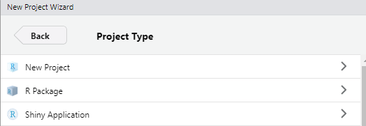
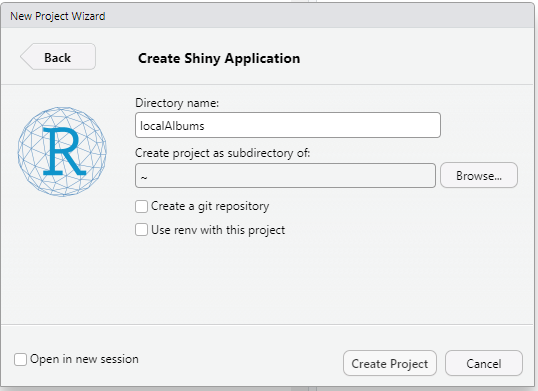
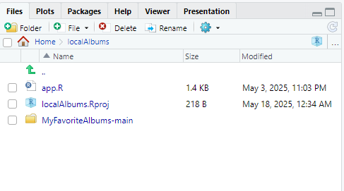
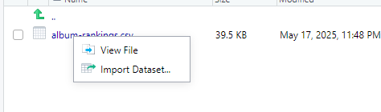

## Run App Locally

To run the application locally follow the steps below:

<!-- Add a note here to say R and RStudio need to be installed -->
1) Open **RStudio**

2) Click on **File** > **New Project**

3) Click **New Directory** > **Shiny Application**

    

4) Name the directory **localAlbums** or something of your choice

5) Click on **Create Project**

    

6) Copy the downloaded **My Favorite Albums** source file into the newly created project directory
<!-- Add a picture below -->

7) **Navigate to `<Source Folder Name>`**<Source Folder Name> **> data > album-rankings.csv**

    a) Once the dropdown appears, click **Import Dataset > Import**
    
    

8) Click on **app.R** and then `RunApp` button to run the application