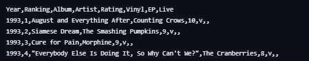

<!-- _sidebar.md -->

# EDIT CSV

>**Note**: The format of your custom CSV must match exactly with the format of the original

To edit the CSV file, follow the steps below
    
1) Navigate to your spreadsheet application of choice: (Google Sheets, Excel).

2) Create a blank spreadsheet.

3) Add the following column names in order:

`Year, Ranking, Album, Artist, Rating, Vinyl, EP, Live`

4) Fill up the spreadsheet by adding your personalized data, such that it matches the columns.
<!-- Insert an example here -->

5) Save the file with the following name: **album-rankings.csv**.

<!-- Maybe add a note saying it has to be saved as a CSV -->
>**Note**: In order to work properly with custom data, the file must be saved as a CSV

6) Replace the existing CSV file with your created CSV file and run the application locally to view results.

<!-- Make Run the Application have a link to localApp running steps -->
To learn how to run application locally, please visit: [Running the Application Locally](/Tasks/appLocal.md)