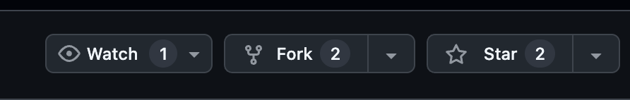
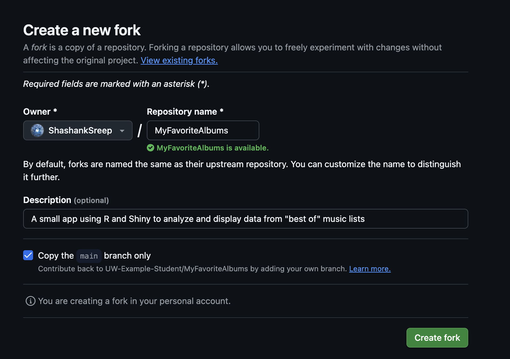
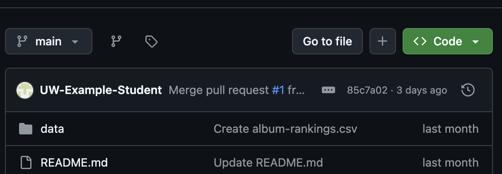
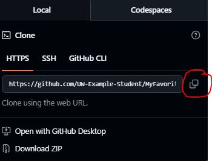

<!-- _sidebar.md -->

## Fork The Source Code from the GitHub Repository

**Note**: Forking a GitHub repository aloows for you to maintain version control independently without affecting the original repository
1) [Create](https://docs.github.com/en/get-started/start-your-journey/creating-an-account-on-github) a GitHub account, if you do not already have one.
    - If you do have a GitHub account, make sure you are signed in.

2) Once signed in, navigate to the [repository](https://github.com/UW-Example-Student/MyFavoriteAlbums)

3) Click on the **Fork** button.

    

4) Make sure your account name is the owner name, and select a repository repository name if you would like (although the default is perfectly fine as well).


5) Click on **Create Fork** at the bottom right of the page.

    

    - If successfully done, you should see a repository created, with the ‘Repository name’ in your list of repositories.

6) Navigate to your forked repository, and download the source code.

Alternatively, you can choose to **clone** the repository.

>**Note**: If you choose to clone the repository, when pushing, you must push to your personal repository, not the one you cloned from

## Clone the Source Code
1) [Create](https://docs.github.com/en/get-started/start-your-journey/creating-an-account-on-github) a GitHub account, if you do not already have one.
    - If you do have a GitHub account, make sure you are signed in.

2) Once signed in, navigate to the [repository](https://github.com/UW-Example-Student/MyFavoriteAlbums).

3) Click on the green **Code** dropdown.

  

4) Clone with HTTPS by clicking on the clipboard to copy the link, or manually copy the link.

 

5) Open your terminal and do the following:

    ```
    git clone <HTTPS REPO LINK YOU COPIED>

    ```

If done correctly, this should be saved in the directory, you performed this command in.

6) Now, you can run the app locally by following the steps: [Run App Locally](/Tasks/appLocal.md).

>**Tips**: Ensure you have git tools installed in your terminal, or are using something that allows for git commands

For instructions, please visit: [Clone Git Repository](https://docs.github.com/en/repositories/creating-and-managing-repositories/cloning-a-repository).
