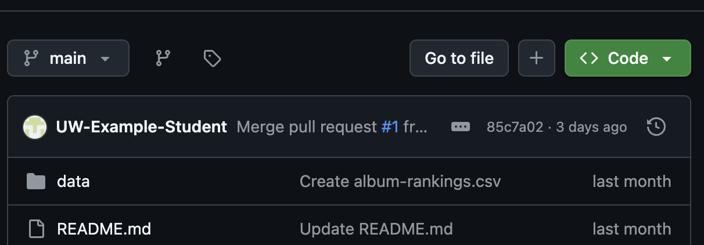
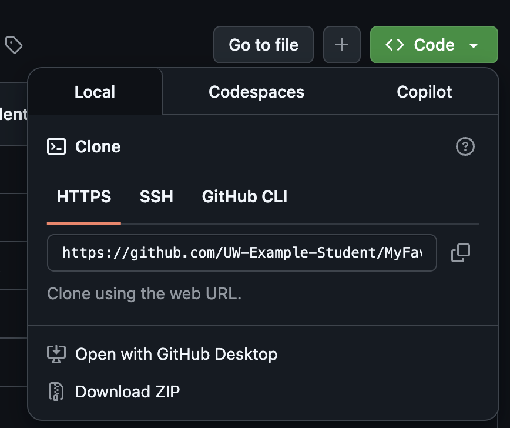

## Download the Source Code from the GitHub Repository

1) In your browser, visit the GitHub repository containing the source code: [Source Code](https://github.com)
2) Click on the green **Code** button
   
   

   - If done correctly, you should see a dropdown, as shown below
     

3) Click on the option: **Download ZIP**, and save it to your folder location of choice

4) Once downloaded, [unzip](https://example.com/linktounzip) the file
   - If done correctly, you should be able to see all of the file contents, matching 1:1 with the GitHub
