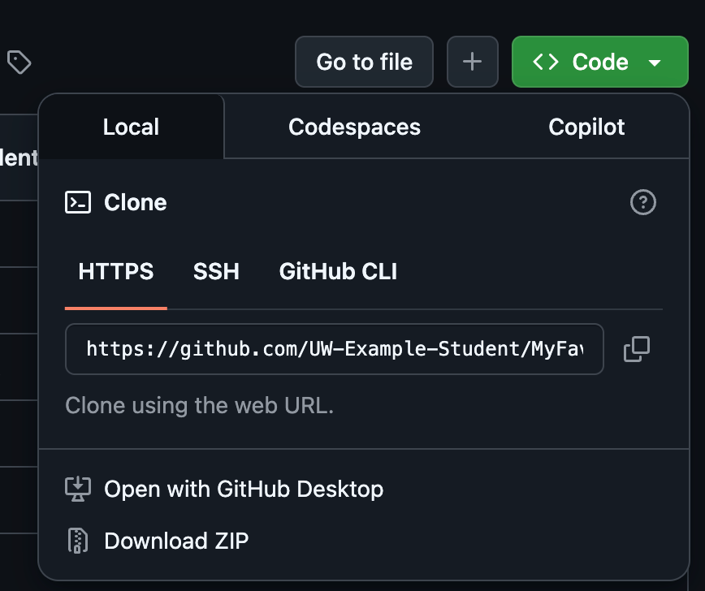

<!-- _sidebar.md -->

## Download the Source Code from the GitHub Repository

1) In your browser, visit the GitHub repository containing the source code: [Source Code](https://github.com/UW-Example-Student/MyFavoriteAlbums)
2) Click on the green **Code** button
   
  

   - If done correctly, you should see a dropdown, as shown below

   

3) Click on the option: **Download ZIP**, and save it to your folder location of choice

4) Once downloaded, [unzip](https://support.microsoft.com/en-us/windows/zip-and-unzip-files-8d28fa72-f2f9-712f-67df-f80cf89fd4e5) the file
   - If done correctly, you should be able to see all of the file contents, matching exactly with the GitHub repository
